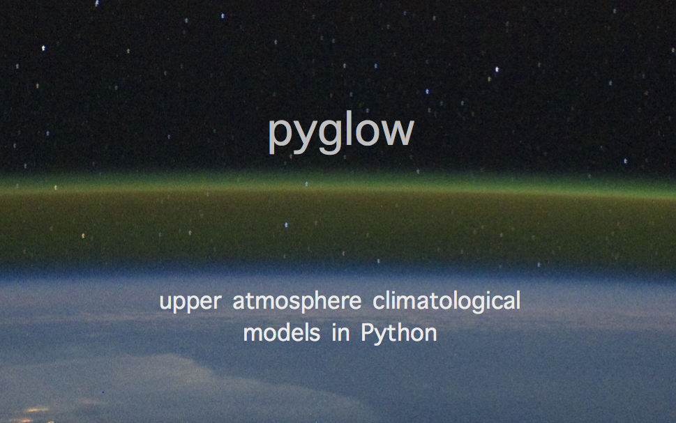

Semaphore CI: [](https://semaphoreci.com/timduly4/pyglow)

Travis CI: [](https://travis-ci.com/timduly4/pyglow)



[_(airglow viewed aboard the ISS)_](http://en.wikipedia.org/wiki/File:Cupola_above_the_darkened_Earth.jpg)

# Overview

`pyglow` is a Python module that wraps several upper atmosphere climatological models written in FORTRAN, such as the Horizontal Wind Model (HWM), the International Geomagnetic Reference Field (IGRF), the International Reference Ionosphere (IRI), and the Mass Spectrometer and Incoherent Scatter Radar (MSIS).

It includes the following upper atmospheric models:

  * HWM 1993
  * HWM 2007
  * HWM 2014
  * IGRF 11
  * IGRF 12
  * IRI 2012
  * IRI 2016
  * MSIS 2000

pyglow also provides access to the the following geophysical indices:
  * AP
  * Kp
  * F10.7
  * DST
  * AE

`pyglow` offers access to these models & indices in a convenient, high-level object-oriented interface within Python.

# Prerequisites

`pyglow` requires the following packages for installation:

1. `gfortran` (`$ sudo apt-get install gfortran`)
2. `f2py` (`$ pip install numpy --upgrade`)
3. Python packages listed in `requirements.txt` (`$ pip install -r requirements.txt`)

# Installation

### I'm Feeling Lucky:

First, checkout the repository:

```
$ git clone git://github.com/timduly4/pyglow.git pyglow
```

Change directories into the repository folder, compile the f2py bindings, then install the Python package:
```
$ cd pyglow/
$ make -C src/pyglow/models source
$ python3 setup.py install --user
```

### Trouble in downloading model files:

If you have problems downloading files from the official websites,  follow the next steps:

(1) Create the local http server:

```
$ cd static/
$ python3 -m http.server 8080
```

(2) Edit the file `src/pyglow/models/Makefile`, replace the appropriate line with the following code:

```
download:
  python get_models_offline.py
```

(3) Compile the f2py bindings, then install the Python package:

```
$ cd pyglow/
$ make -C src/pyglow/models source
$ python3 setup.py install --user
```

Note: The model files may not be latest.

### Individual installation steps:

If you have troubles, follow the individual installation steps:

(1) Download the package:
```
$ git clone git://github.com/timduly4/pyglow.git
$ cd pyglow/
```

(2) Download the climatological models and wrap them with f2py:
```
$ cd ./src/pyglow/models/
$ make all
```
  * If successful, there should be a `*.so` file in each of the `./models/dl_models/<model>/` directories:

    ```
    $ find . -name "*.so"
    ./dl_models/hwm07/hwm07py.so
    ./dl_models/hwm93/hwm93py.so
    ./dl_models/hwm14/hwm14py.so
    ./dl_models/igrf11/igrf11py.so
    ./dl_models/igrf12/igrf12py.so
    ./dl_models/iri12/iri12py.so
    ./dl_models/iri16/iri16py.so
    ./dl_models/msis/msis00py.so
    ```

(3) Install the Python package
```
$ cd ../../../   # get back to root directory
$ python3 setup.py install --user
```
  * On a mac, the folder `pyglow` and `*.so` files from `./models/dl_models/<model>/` should be in `/Library/Frameworks/Python.framework/Versions/3.7/lib/python3.7/site-packages`
  * The `--user` flag installs the package locally (i.e., you do not need `sudo` access)

# Unit tests

See unit tests in `./test`.  For example, run the unittest suite with:

`$ pytest test/`

(Be sure that the f2py modules have been compiled via `$ make -C src/pyglow/models source`, first.)

# Examples

See example scripts located in `./examples` for example calls to `pyglow`.

# Docker

We've included a Dockerfile for `pyglow`.  To build the image:

`$ docker build -t pyglow .`

This will compile and install pyglow within the Docker container.

Run the unit tests within the container via:

`$ docker run pyglow`

# Hints

### General
1. Use tab completion in ipython to view the full set of member data and variables available in the Point class.
  * For example, in the test code, run `pt.<TAB><TAB>` and class information will be listed.

### Updating geophysical indices with `pyglow.update_indices()`
You'll need to download the geophysical indices as they become available.  The `update_indices()` function is available in pyglow that enables you do this:

```
# Grabs indices between 2016 and 2018:
$ python3 -c "import pyglow; pyglow.update_indices(2016, 2018)"
```

Note: you only need to run this function when you would like to update the indices.

You can check if you have geophysical indices between dates with:
```
$ python3 -c "import pyglow;  pyglow.check_stored_indices('2015-01-01', '2019-01-01')"

Checking: input date range:
  2015-01-01
  to
  2019-01-01
>> We have all of the geophysical indices files between these dates.
```

# Uninstallation

The install directory for pyglow can be outputted via `python3 -c "import pyglow; print(pyglow.__file__)"`.  For example:
```
~ $ python3 -c "import pyglow; print(pyglow.__file__)"
/Users/duly/Library/Python/3.7/lib/python/site-packages/pyglow/__init__.pyc
```
This tells you the installation location, and then you can remove the package with:
```
~ $ rm -rf /Users/duly/Library/Python/3.7/lib/python/site-packages/pyglow
```
